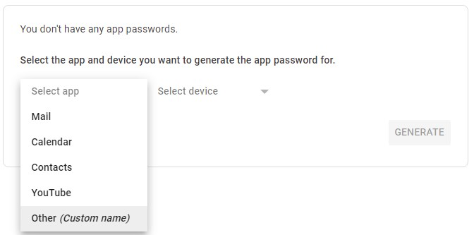

# Automatic Email Writer

For those who send automated emails to friends or coworkers, this program is for you! This program will allow you to
send emails automatically using your terminal window. This program uses the EmailMessage class from email.message, SSL, and SMTPLib in order to securely send emails across the web.

## User Guide

### How to install and configure

In order to run this project, all you need is Python installed on your system. To do this, go to
https://www.python.org/downloads/ and follow the installation instructions for your system.

* To check if python is installed, open your terminal window and type the command `python --version`

Next, you're going to need to configure the program to meet your specific needs. Here's how:

1. Clone this repository
   * You can do this by clicking on the green `Code` menu and selecting `Download ZIP`.
   
   
   * Then, use whatever ZIP manager you use to extract the files to its desired directory.
2. In this project's directory, enter the `email_writer.py` file in the `src` directory using any text editor. If you
aren't sure what to use, use Notepad which is natively installed to your system.
3. Replace the values within the quotes for `email_sender`, `email_reciever`, `subject`, and `body` with the information
required for your use of the application. (NOTE: DO NOT edit the `email_password` value just yet)
4. Go to https://myaccount.google.com/ and set up two-factor authentication. This program cannot be used without this.
5. Next, go to https://myaccount.google.com/apppasswords and follow the steps below:
    * Sign in to your Google account
    * You will be greeted with this screen:
   
    * Under the `Select app` dropdown menu, select `Other (Custom name)`
   
    * Give the custom app a name; in this case, I named it "Python", and click `Generate`.
   
    * Your password will be generated. Copy it to your clipboard. **DO NOT** share this password with _anyone!_
   
6. Replace the value within quotes for the `email_password` variable with the password you just copied.
7. Open your terminal window and use the `cd` command to navigate to the directory in which this project was cloned.
8. Use the `cd` command once more to enter the `src` directory.
9. Enter the command `python email_writer.py`, and your email should be sent to its intended receiver.

## Features I wish to implement in the future

In the future, I wish to implement a feature that allows the user to send automated emails on a specified time interval.

## Like this project?

Give it a star!